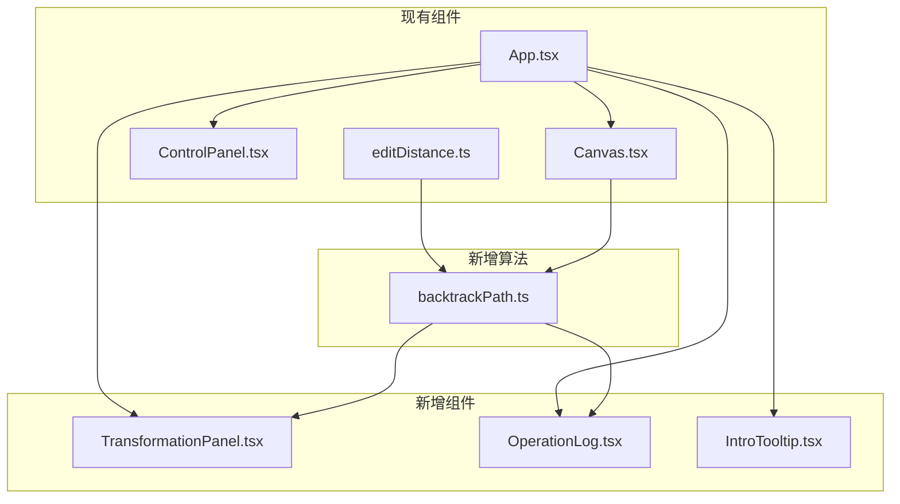

# Design Document: Edit Path Visualization

## Overview

本设计文档描述如何改进编辑距离可视化工具，增加"编辑路径可视化"功能，帮助用户直观理解字符串转换过程。核心思路是在DP表格计算完成后，通过回溯算法提取最优编辑路径，并以动画形式展示源字符串如何一步步变成目标字符串。

## Architecture



## Components and Interfaces

### 1. backtrackPath.ts - 编辑路径回溯算法

```typescript
// 编辑操作类型
interface EditOperation {
  type: 'insert' | 'delete' | 'replace' | 'match';
  position: number;        // 在源字符串中的位置
  sourceChar?: string;     // 源字符（delete/replace时）
  targetChar?: string;     // 目标字符（insert/replace时）
  dpCell: { row: number; col: number };  // 对应的DP表格单元格
}

// 编辑路径
interface EditPath {
  operations: EditOperation[];
  totalDistance: number;
  insertCount: number;
  deleteCount: number;
  replaceCount: number;
  matchCount: number;
}

// 回溯函数
function backtrackEditPath(
  dpTable: number[][],
  word1: string,
  word2: string
): EditPath;

// 应用操作得到中间字符串
function applyOperation(
  currentString: string,
  operation: EditOperation
): string;

// 生成所有中间状态
function generateIntermediateStates(
  word1: string,
  operations: EditOperation[]
): string[];
```

### 2. TransformationPanel.tsx - 字符串转换面板

展示源字符串到目标字符串的实时转换过程。

```typescript
interface TransformationPanelProps {
  word1: string;
  word2: string;
  currentOperation: EditOperation | null;
  currentString: string;
  isPathMode: boolean;
}
```

功能：
- 显示源字符串和目标字符串
- 显示当前中间状态字符串
- 对当前操作的字符进行高亮动画
- 显示操作类型标签

### 3. OperationLog.tsx - 操作日志面板

```typescript
interface OperationLogProps {
  operations: EditOperation[];
  currentIndex: number;
  onOperationClick: (index: number) => void;
}
```

功能：
- 滚动列表显示所有操作
- 格式化显示每个操作
- 点击跳转到对应步骤
- 高亮当前操作

### 4. IntroTooltip.tsx - 入门引导提示

```typescript
interface IntroTooltipProps {
  onDismiss: () => void;
  visible: boolean;
}
```

功能：
- 首次访问时显示
- 简单解释编辑距离概念
- 可关闭并记住用户选择

## Data Models

### EditOperation

| 字段 | 类型 | 描述 |
|------|------|------|
| type | 'insert' \| 'delete' \| 'replace' \| 'match' | 操作类型 |
| position | number | 操作在当前字符串中的位置 |
| sourceChar | string? | 被操作的源字符 |
| targetChar | string? | 目标字符 |
| dpCell | {row, col} | 对应DP表格位置 |

### EditPath

| 字段 | 类型 | 描述 |
|------|------|------|
| operations | EditOperation[] | 操作序列（从头到尾） |
| totalDistance | number | 总编辑距离 |
| insertCount | number | 插入操作数 |
| deleteCount | number | 删除操作数 |
| replaceCount | number | 替换操作数 |
| matchCount | number | 匹配操作数 |

### TransformationState

| 字段 | 类型 | 描述 |
|------|------|------|
| currentString | string | 当前中间字符串 |
| operationIndex | number | 当前操作索引 |
| highlightPosition | number | 高亮字符位置 |

## Correctness Properties

*A property is a characteristic or behavior that should hold true across all valid executions of a system-essentially, a formal statement about what the system should do. Properties serve as the bridge between human-readable specifications and machine-verifiable correctness guarantees.*

### Property 1: Edit Path Validity and Completeness

*For any* DP table computed from word1 and word2, the backtracked edit path SHALL:
- Start from cell (n1, n2) and end at cell (0, 0)
- Have each step move to an adjacent cell (left, up, or diagonal)
- Have operation counts (insert + delete + replace) equal to the total edit distance
- Have total operations (including matches) equal to max(n1, n2) when following the path

**Validates: Requirements 1.2, 1.3, 2.3**

### Property 2: Intermediate String Transformation

*For any* source string word1 and edit path operations, applying all operations in sequence SHALL produce the target string word2. Each intermediate state SHALL be a valid string.

**Validates: Requirements 1.5**

### Property 3: Operation Log Formatting

*For any* EditOperation, the formatted log entry SHALL contain:
- A step number (1-indexed)
- The operation type in Chinese (插入/删除/替换/匹配)
- The relevant character(s)
- The position in the string

**Validates: Requirements 5.2**

### Property 4: Navigation State Consistency

*For any* edit path with N operations, stepping forward N times from index 0 SHALL reach index N-1, and stepping backward N times from index N-1 SHALL return to index 0.

**Validates: Requirements 4.2**

## Error Handling

| 场景 | 处理方式 |
|------|----------|
| 空字符串输入 | 正常处理，显示全插入或全删除路径 |
| 超长字符串 | 限制最大长度，显示警告 |
| 回溯失败 | 显示错误提示，回退到普通模式 |
| 动画中断 | 保持当前状态，允许重新播放 |

## Testing Strategy

### 测试框架

使用 **Vitest** 作为测试框架，配合 **fast-check** 进行属性测试。

### 单元测试

1. `backtrackEditPath` 函数测试
   - 测试简单字符串对的回溯结果
   - 测试边界情况（空字符串、相同字符串）

2. `applyOperation` 函数测试
   - 测试各种操作类型的字符串变换
   - 测试边界位置的操作

3. `formatOperationLog` 函数测试
   - 测试各种操作的格式化输出

### 属性测试

每个属性测试必须：
- 使用 fast-check 生成随机测试数据
- 运行至少 100 次迭代
- 使用注释标注对应的正确性属性

```typescript
// **Feature: edit-path-visualization, Property 1: Edit Path Validity and Completeness**
test.prop([fc.string(), fc.string()])('backtrack produces valid path', (word1, word2) => {
  // ... property test implementation
});
```

### 集成测试

1. 组件渲染测试
   - TransformationPanel 正确显示字符串状态
   - OperationLog 正确渲染操作列表

2. 交互测试
   - 点击操作日志跳转到正确步骤
   - 播放控制正确更新状态
